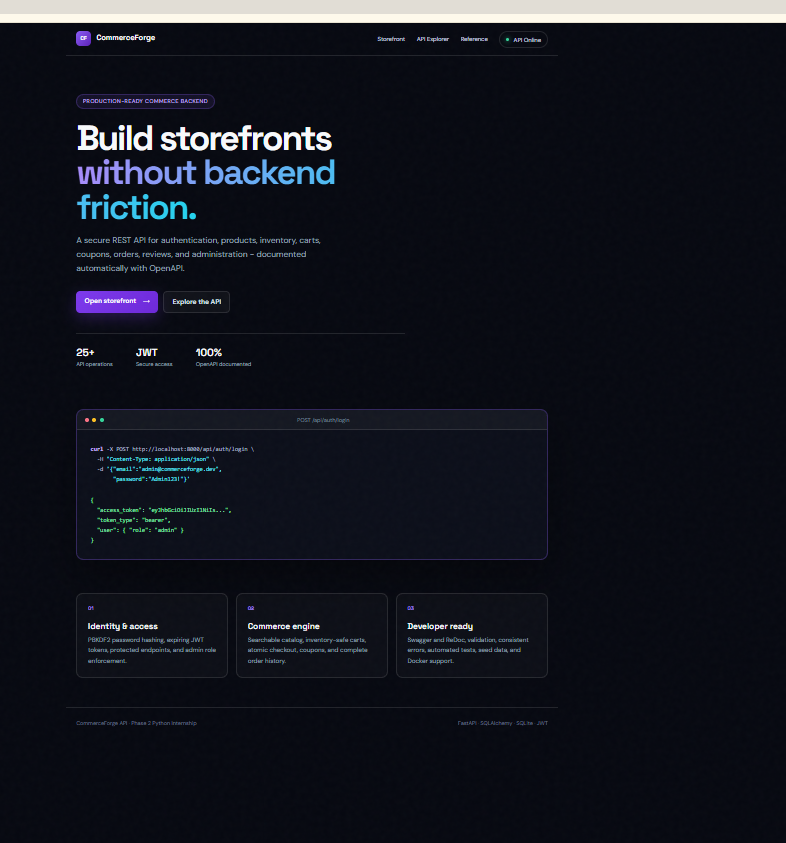
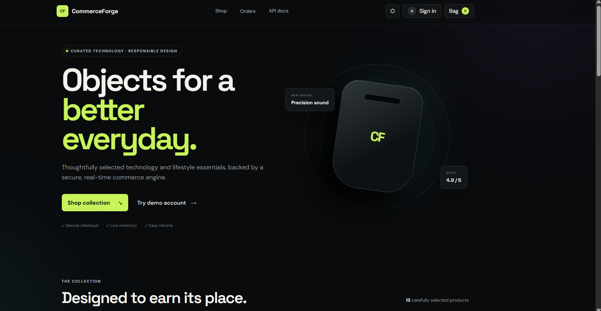
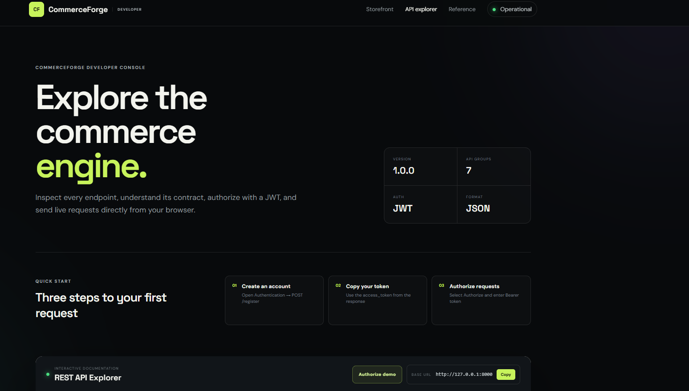
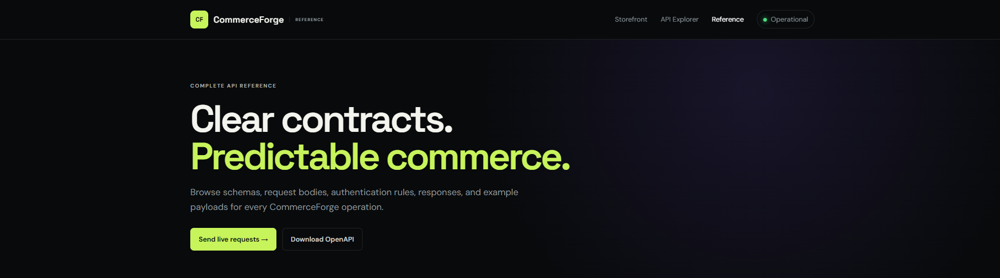

# CommerceForge API

CommerceForge is a secure, production-style RESTful e-commerce platform built for the Sqrock IT Solutions Python Internship Phase 2 - Task 4. It includes a complete interactive storefront, polished API homepage, Swagger documentation, JWT authentication, role-based administration, a searchable catalog, inventory-aware carts, atomic checkout, coupons, orders, and reviews.

## Project screenshots

<table>
  <tr>
    <td width="50%"></td>
    <td width="50%"></td>
  </tr>
  <tr>
    <td align="center"><strong>API landing page</strong></td>
    <td align="center"><strong>Interactive storefront</strong></td>
  </tr>
  <tr>
    <td></td>
    <td></td>
  </tr>
  <tr>
    <td align="center"><strong>Developer console</strong></td>
    <td align="center"><strong>API reference</strong></td>
  </tr>
</table>

## Highlights

- Branded interactive Swagger developer console (`/docs`) and ReDoc (`/redoc`) documentation
- Secure JWT login and PBKDF2-SHA256 password hashing
- User and administrator role-based access control
- Category and product CRUD with soft-delete support
- Search, category, price-range, stock, and pagination filters
- Shopping cart with real-time stock validation
- Atomic order checkout, inventory deduction, order history, and status management
- Coupon discounts and product ratings/reviews
- SQLAlchemy 2 database layer with SQLite by default and PostgreSQL-ready configuration
- Seed catalog and administrator account for demonstrations
- Responsive, advanced dark API landing page
- Fully interactive responsive storefront with light/dark themes
- Working signup, login, product search, category filtering, bag, checkout, orders, and admin console
- Thirteen demonstration products across electronics, lifestyle, home office, wellness, and travel
- Clickable product details and interactive trust cards
- Branded API reference and live service-status interfaces
- Docker, Docker Compose, Render deployment configuration, and automated tests
- Importable Postman collection and one-click Windows launcher

## Quick start

```bash
python -m venv .venv
source .venv/bin/activate        # Windows: .venv\Scripts\activate
pip install -r requirements-dev.txt
cp .env.example .env             # Windows: copy .env.example .env
uvicorn app.main:app --reload
```

Open:

- Landing page: `http://127.0.0.1:8000`
- Interactive store: `http://127.0.0.1:8000/store`
- Swagger UI: `http://127.0.0.1:8000/docs`
- ReDoc: `http://127.0.0.1:8000/redoc`
- Status dashboard: `http://127.0.0.1:8000/status`
- Machine-readable health check: `http://127.0.0.1:8000/health` (returns JSON for API clients and redirects browsers to Status)

On Windows, you can instead double-click `START_COMMERCEFORGE.bat`.

Create the administrator securely through environment variables before the first start:

```text
ADMIN_NAME=Store Admin
ADMIN_EMAIL=your-admin-email@example.com
ADMIN_PASSWORD=use-a-long-unique-password
```

Never commit the real administrator password or `SECRET_KEY`. When these variables are configured, the administrator account is created automatically on first startup.

## Main API routes

| Method | Endpoint | Access | Purpose |
|---|---|---|---|
| POST | `/api/auth/register` | Public | Create an account and receive a JWT |
| POST | `/api/auth/login` | Public | Authenticate and receive a JWT |
| GET | `/api/auth/me` | User | View the current account |
| GET | `/api/products` | Public | Search and filter the catalog |
| POST/PATCH/DELETE | `/api/products` | Admin | Manage products and inventory |
| GET/POST | `/api/categories` | Public/Admin | Browse or create categories |
| GET/POST/DELETE | `/api/cart` | User | Manage shopping cart items |
| POST | `/api/orders/checkout` | User | Place an inventory-safe order |
| GET | `/api/orders` | User | View personal order history |
| GET/PATCH | `/api/admin/orders` | Admin | Manage all orders and statuses |
| GET/POST | `/api/products/{id}/reviews` | Public/User | Browse or create reviews |
| POST | `/api/admin/coupons` | Admin | Create discount coupons |

## Authentication example

```bash
curl -X POST http://127.0.0.1:8000/api/auth/login \
  -H "Content-Type: application/json" \
  -d '{"email":"YOUR_EMAIL","password":"YOUR_PASSWORD"}'
```

Use the returned token on protected routes:

```bash
curl http://127.0.0.1:8000/api/auth/me \
  -H "Authorization: Bearer YOUR_TOKEN"
```

## Run tests

```bash
pytest -q
```

The suite covers health checks, registration, login, authorization, catalog filtering, admin CRUD, cart operations, checkout, coupons, inventory, order history, reviews, duplicates, and validation failures.

## Docker

```bash
docker compose up --build
```

## Architecture

```text
commerceforge/
├── app/
│   ├── main.py          # Routes, lifecycle, catalog and commerce services
│   ├── models.py        # SQLAlchemy entities and relationships
│   ├── schemas.py       # Pydantic input/output contracts
│   ├── security.py      # JWT, passwords and authorization dependencies
│   ├── database.py      # Engine, session and dependency
│   └── static/          # Responsive API landing page
├── tests/test_api.py
├── Dockerfile
├── docker-compose.yml
├── render.yaml
└── requirements*.txt
```

## Security notes

- Passwords are never stored in plaintext.
- Product administration and order status changes require the `admin` role.
- All request bodies and query parameters are validated by Pydantic.
- Checkout revalidates stock before updating inventory.
- Product removal is a soft delete so historical orders remain valid.
- Set a strong environment-provided `SECRET_KEY` for deployment.

## Submission description

CommerceForge uses a layered FastAPI and SQLAlchemy architecture. Pydantic schemas enforce API contracts, JWT dependencies protect private operations, and role checks isolate administrator functions. Cart checkout validates stock, calculates coupon discounts, creates immutable order-item snapshots, reduces inventory, and clears the cart in one database transaction. The application exposes standards-based OpenAPI documentation and is ready for Docker or Render deployment.
